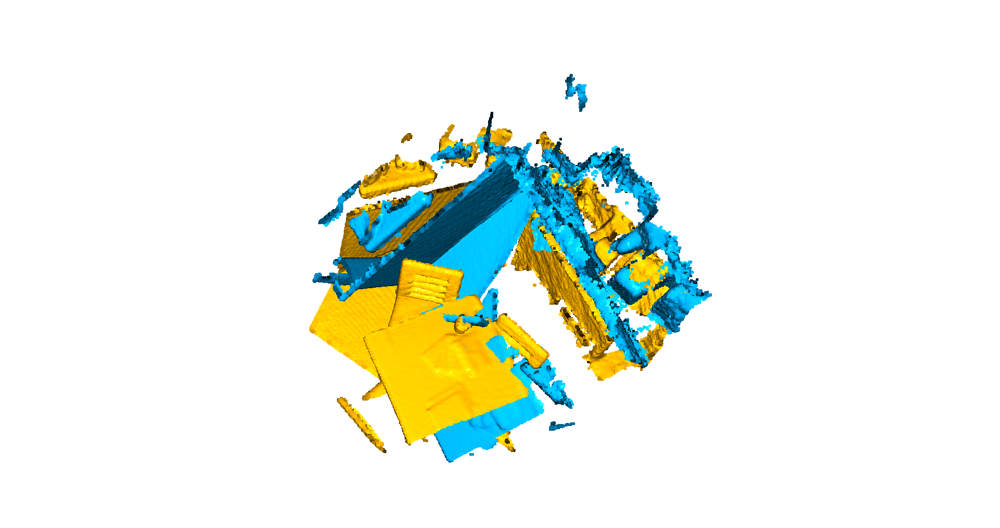
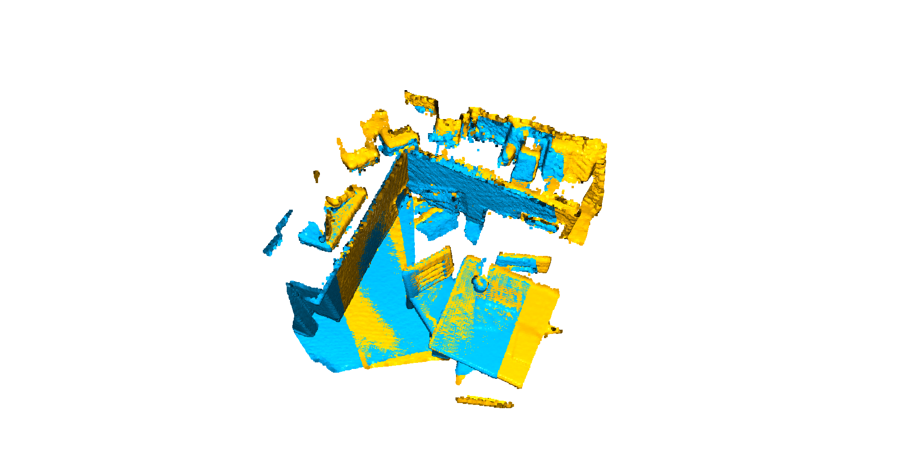
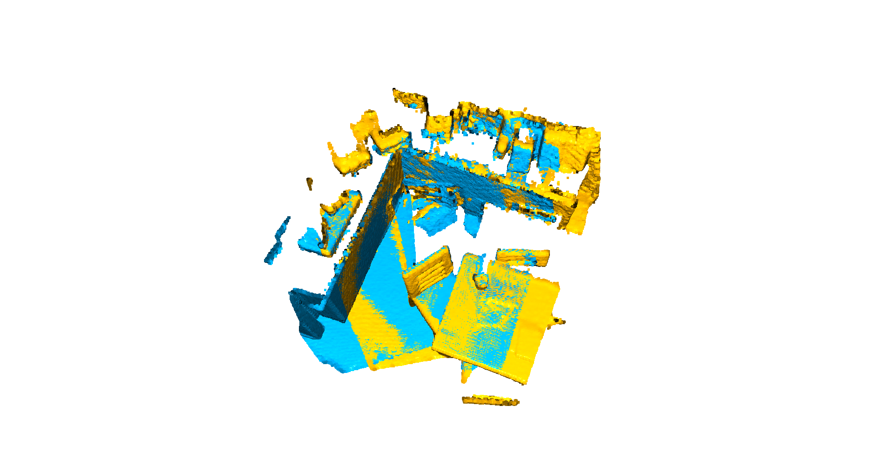
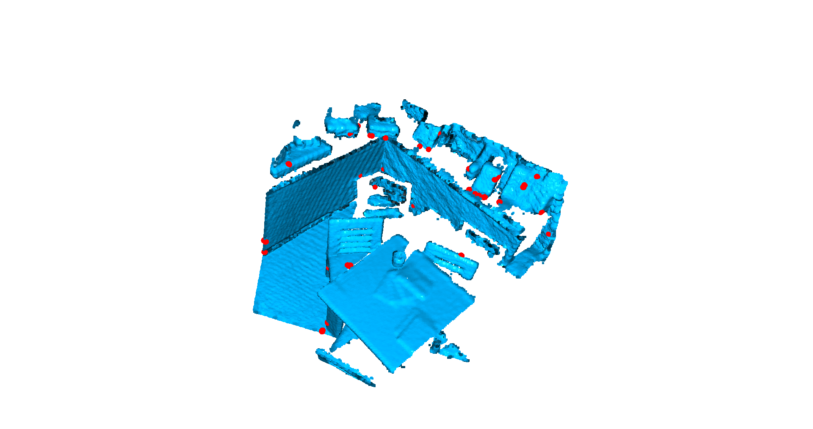
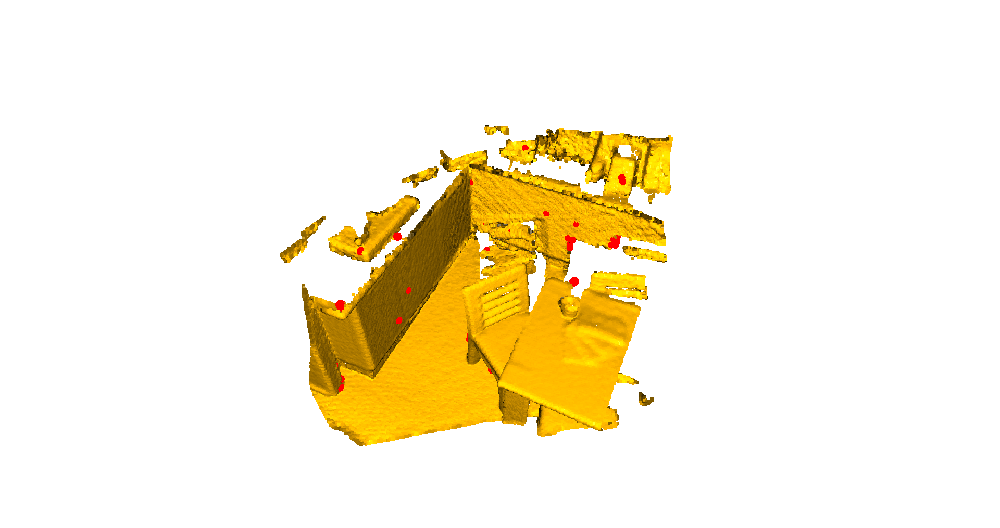
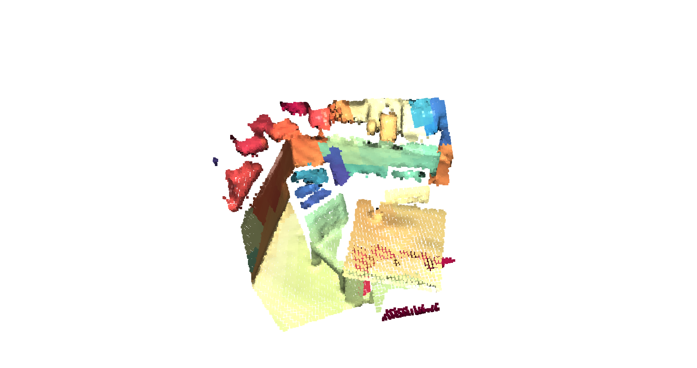
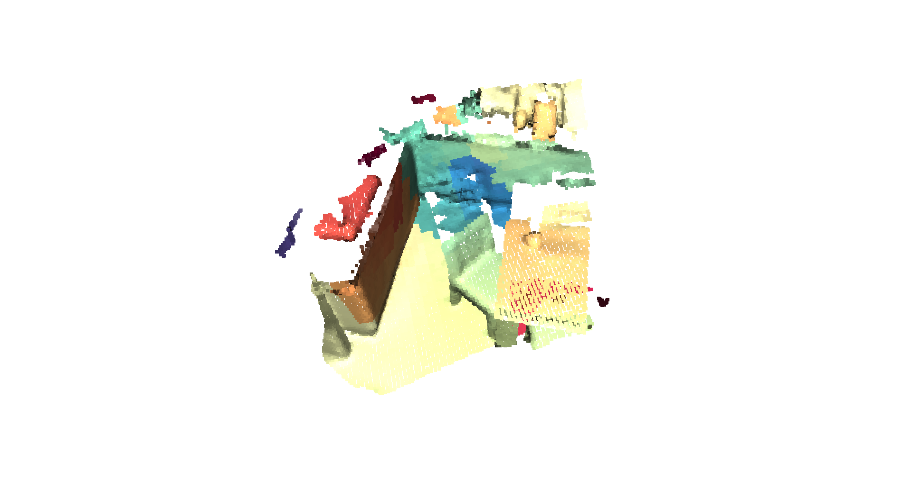

# D3Feat repository

PyTorch implementation of D3Feat for CVPR'2020 Oral paper ["D3Feat: Joint Learning of Dense Detection and Description of 3D Local Features"](https://arxiv.org/abs/2003.03164), by Xuyang Bai, Zixin Luo, Lei Zhou, Hongbo Fu, Long Quan and Chiew-Lan Tai. D3Feat is also available in [Tensorflow](https://github.com/XuyangBai/D3Feat).

This paper focus on dense feature detection and description for 3D point clouds in a joint manner. If you find this project useful, please cite:

```bash
@article{bai2020d3feat,
  title={D3Feat: Joint Learning of Dense Detection and Description of 3D Local Features},
  author={Xuyang Bai, Zixin Luo, Lei Zhou, Hongbo Fu, Long Quan and Chiew-Lan Tai},
  journal={arXiv:2003.03164 [cs.CV]},
  year={2020}
}

```

**The TensorFlow implementation can be found [here](https://github.com/XuyangBai/D3Feat).**

**Check our new paper on outlier rejection for more robust registration [here](https://github.com/XuyangBai/PointDSC) !**

## Introduction

A successful point cloud registration often lies on robust establishment of sparse matches through discriminative 3D local features. Despite the fast evolution of learning-based 3D feature descriptors, little attention has been drawn to the learning of 3D feature detectors, even less for a joint learning of the two tasks. In this paper, we leverage a 3D fully convolutional network for 3D point clouds, and propose a novel and practical learning mechanism that densely predicts both a detection score and a description feature for each 3D point. In particular, we propose a keypoint selection strategy that overcomes the inherent density variations of 3D point clouds, and further propose a self-supervised detector loss guided by the on-the-fly feature matching results during training. Finally, our method achieves state-of-the-art results in both indoor and outdoor scenarios, evaluated on 3DMatch and KITTI datasets, and shows its strong generalization ability on the ETH dataset. Towards practical use, we show that by adopting a reliable feature detector, sampling a smaller number of features is sufficient to achieve accurate and fast point cloud alignment.


## Installation

* Create the environment and install the required libaries:

           conda env create -f environment.yml

* Compile the C++ extension module for python located in `cpp_wrappers`. Open a terminal in this folder, and run:

          sh compile_wrappers.sh

## Experiments

We only support 3DMatch dataset currently. Please look for the detailed instructions to download 3DMatch dataset in [Original D3Feat Repo](https://github.com/XuyangBai/D3Feat). To train the network, please run 
```sh
python train.py
```
The configuration can be changed in `config.py`. The snapshot and tensorboard file be saved in `snapshot/` and `tensorboard/`. The testing can be done by runnning
```sh
python test.py --chosen_snapshot [timestr of the model]
```
Then the geometric registration result will be saved in `geometric_registration/`.

Pretrained weights: [Google Drive](https://drive.google.com/file/d/1aE_Fkt9Cw3Dgq8MbgW5CGCxhy9f5P_Yu/view?usp=sharing)

## Acknowledgment

We would like to thank the open-source code of [KPConv](https://github.com/HuguesTHOMAS/KPConv-PyTorch).


# Replenish
## Added registration demo
The demo data is placed in the demo_data path.
You should modify the "TODO" in demo file according to your own point cloud characteristics. Then, the demo can be showed by running 
```sh
python demo.py
```
## Demo example diagram
### 1. original_pose


### 2. after_ransac


### 3. after_icp


### 4. keypts_src


### 5. keypts_tgt


### 6. change the feature dimention to 3, then visual feature, the left is src_feat and the right is tgt_feat

